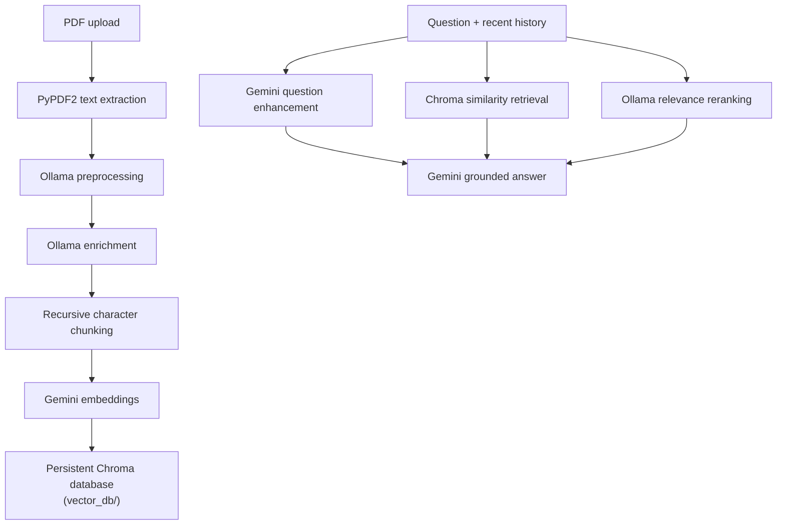

# DocuMind

DocuMind is a Streamlit PDF question-answering assistant. Upload a text-based PDF, build a local searchable knowledge base, and ask questions in a conversational interface. Responses are grounded in the indexed document rather than general web knowledge.

The application combines Google Gemini for embeddings and final answers with Ollama models for document preparation, query expansion, and result reranking.

## Features

- Upload one PDF from the Streamlit sidebar.
- Extract selectable text and report the page and character counts before indexing.
- Clean and enrich extracted content before it is split into retrieval chunks.
- Store embeddings in a persistent local Chroma database.
- Expand questions using recent conversation history.
- Rerank retrieved chunks with conversation-aware relevance scoring.
- Generate concise, markdown-friendly answers using only retrieved document context.
- Fall back to direct vector similarity retrieval if enhanced retrieval fails.
- Keep the current conversation in Streamlit session state.

## How It Works



The main entry point is [`main.py`](main.py). The RAG pipeline is split into focused modules under [`rag/`](rag/):

| Module                                     | Responsibility                                                     |
| ------------------------------------------ | ------------------------------------------------------------------ |
| [`rag/ingest.py`](rag/ingest.py)           | Enrich, chunk, embed, and persist uploaded text.                   |
| [`rag/pre_process.py`](rag/pre_process.py) | Clean PDF extraction noise with Ollama.                            |
| [`rag/improve.py`](rag/improve.py)         | Expand and clarify content without intentionally adding new facts. |
| [`rag/answer.py`](rag/answer.py)           | Enhance questions and retrieve context from Chroma.                |
| [`rag/rerank.py`](rag/rerank.py)           | Ask Ollama to score and order candidate chunks.                    |
| [`logs/logger.py`](logs/logger.py)         | Configure application logging in `logs/app.log`.                   |

## Requirements

- Python 3.10 or newer
- A Google AI API key with access to the Gemini models used by the project
- Ollama installed and running locally
- The Ollama model configured in the source:
  - `gpt-oss:120b-cloud`

The application currently uses these Google models in code:

- `gemini-embedding-2-preview` for document and query embeddings
- `gemini-3.6-flash` for question enhancement and final answers

Model availability depends on the Google AI and Ollama accounts configured on the machine. If a model is unavailable, update the model constants or constructor arguments in the relevant RAG module.

## Installation

From the repository root on Windows PowerShell:

```powershell
py -m venv .venv
.\.venv\Scripts\Activate.ps1
python -m pip install --upgrade pip
pip install -r requirements.txt
```

If PowerShell blocks activation scripts, either activate the environment through the VS Code Python interpreter selector or run PowerShell with an execution policy that permits your local scripts.

## Configuration

Create a `.env` file in the repository root. Do not commit it.

```dotenv
GOOGLE_API_KEY=your_google_ai_api_key
```

`python-dotenv` loads this file automatically when the application starts. The Google LangChain integration reads `GOOGLE_API_KEY` from the environment.

Start Ollama separately and make sure the configured model is available. For a locally available model, the command is typically:

```powershell
ollama serve
ollama pull gpt-oss:120b-cloud
```

The exact `ollama pull` command may differ for models available to your Ollama account. Verify the installed model with:

```powershell
ollama list
```

## Running the App

With the virtual environment active and Ollama running:

```powershell
streamlit run main.py
```

Streamlit will print a local URL, normally `http://localhost:8501`.

### Typical workflow

1. Open the Streamlit URL.
2. Upload a selectable-text PDF from the sidebar.
3. Review the extracted page and character counts.
4. Select **Build knowledge base** and wait for indexing to finish.
5. Ask questions in the chat input.

Only one uploaded document is active at a time. When a new document is indexed, the existing Chroma collection is deleted and replaced with the new document's vectors.

## PDF Support

DocuMind uses `PyPDF2` text extraction. Text-based PDFs work best. Image-only or scanned PDFs will usually produce no selectable text and must be OCR-processed before uploading. Complex layouts, multi-column pages, tables, headers, and footers may still require manual review because extraction quality depends on the PDF structure.

## Data and Privacy

- The Chroma database is persisted locally under [`vector_db/`](vector_db/).
- Application logs are appended to [`logs/app.log`](logs/app.log).
- Document text and prompts are sent to the configured Google Gemini and Ollama services during indexing and question answering.
- The uploaded PDF itself is not copied to a separate upload directory by this application; its extracted text is held in memory during processing.
- The current `.gitignore` excludes `.env`, `.venv`, and Python caches. Review whether `vector_db/` and `logs/app.log` should be excluded before publishing or sharing the repository.

## Troubleshooting

### `GOOGLE_API_KEY` or authentication errors

Confirm that `.env` is in the same directory as `main.py`, the variable is named `GOOGLE_API_KEY`, and the key has access to the configured Gemini models. Restart Streamlit after changing `.env`.

### Ollama connection or model errors

Check that Ollama is running and that the configured model appears in `ollama list`. The preprocessing, enrichment, and reranking stages all depend on Ollama, so indexing or enhanced retrieval will fail if it is unavailable.

### No text was found

The PDF is likely scanned or image-only. Run OCR on it, save the searchable result, and upload the new file.

### Indexing is slow or uses substantial memory

The application makes multiple LLM calls during indexing and embeds every generated chunk. Large PDFs and large Ollama models can take considerable time and resources. Start with a small text-based PDF when validating the setup.

### Answers are missing or retrieval falls back

Inspect the Streamlit error message and `logs/app.log`. The UI labels direct Chroma similarity search as `vector similarity retrieval`; otherwise it uses the enhanced query and reranking path. Ensure both the Chroma database and the configured embedding model are available.

## Project Structure

```text
CustomAssist/
├── main.py              # Streamlit UI and application orchestration
├── requirements.txt     # Python dependencies
├── rag/                 # Ingestion, retrieval, reranking, and answer pipeline
├── logs/                # Logging configuration and runtime log output
├── vector_db/           # Persistent Chroma data generated by the app
├── .env                 # Local secrets; create this file yourself
└── README.md
```

## Development Notes

- Indexing is triggered explicitly with **Build knowledge base** rather than immediately after upload.
- The upload is identified by a SHA-256 hash in Streamlit session state, preventing repeated indexing during normal reruns.
- The final answer prompt instructs Gemini to say when the document does not contain enough information instead of inventing an answer.
- There is currently no automated test suite or lint configuration in the repository. Manual smoke testing should include PDF extraction, indexing, a grounded question, a follow-up question, and a scanned-PDF failure case.

## License

See [`LICENSE`](LICENSE) for the project license.
